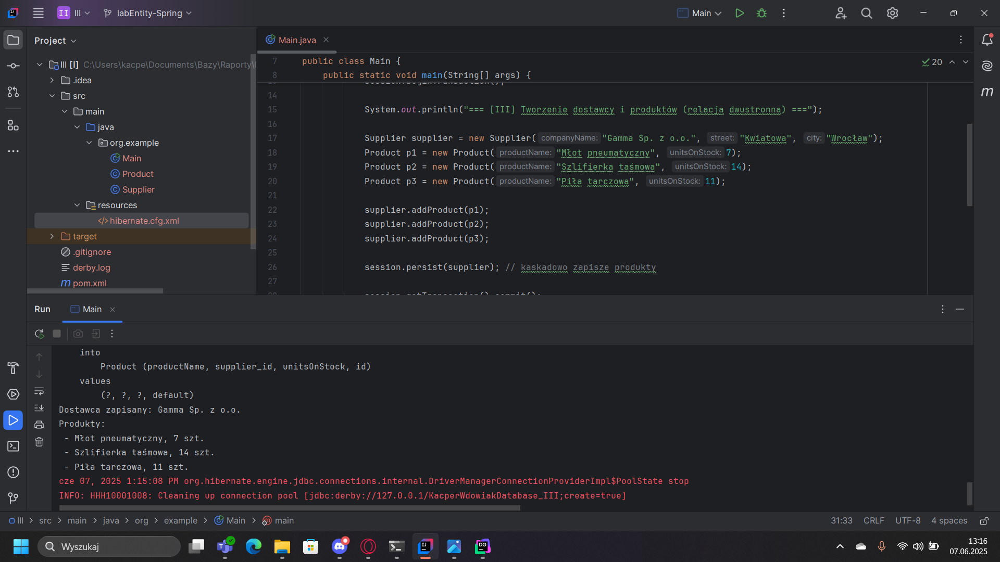

# Sprawozdanie Hibernate

### Autorzy: Radosław Szepielak, Kacper Wdowiak

## Część 1:

Poniżej przedstawiamy zrzuty ekranu wykonania pracy podczas zajęć:


<br><br>
<br><br>


## Część 2:

### Zadanie I: Modyfikacja modelu i wprowadzenie Dostawcy (is supplied by)

Realizację zadania I) przedstawia kod poniżej:

```java
package org.example;

import jakarta.persistence.*;

@Entity
public class Product {
    @Id
    @GeneratedValue(strategy = GenerationType.AUTO)
    private int productID;
    private String productName;
    private int unitsInStock;


    @ManyToOne
    @JoinColumn(name = "supplierID")
    private Supplier supplier;

    public Product() {}

    public Product(String productName, int unitsInStock) {
        this.productName = productName;
        this.unitsInStock = unitsInStock;
    }

    @Override
    public String toString() {
        return productName + " (liczba sztuk" + unitsInStock+")";
    }

    public void setSupplier(Supplier supplier) {
        this.supplier = supplier;
    }

    public Supplier getSupplier() {
        return supplier;
    }
}
```

```java
package org.example;

import jakarta.persistence.*;

@Entity
public class Supplier {
    @Id
    @GeneratedValue(strategy = GenerationType.AUTO)
    public int supplierID;

    private String companyName;
    private String street;
    private String city;

    public Supplier() {}

    public Supplier(String companyName, String street, String city) {
        this.companyName = companyName;
        this.street = street;
        this.city = city;
    }

    @Override
    public String toString() {
        return companyName;
    }
}
```

```java
package org.example;

import jakarta.persistence.Query;
import org.hibernate.Session;
import org.hibernate.SessionFactory;
import org.hibernate.Transaction;
import org.hibernate.cfg.Configuration;

import java.util.List;

public class Main {
    private static SessionFactory sessionFactory = null;

    public static void main(String[] args) {
        sessionFactory = getSessionFactory();
        Session session = sessionFactory.openSession();
        Transaction tx = session.beginTransaction();

        Supplier supplier = new Supplier("Extra dostawca", "Tokarskiego", "Kraków");
        Product productTest = new Product("kredka", 123);

        session.persist(productTest);

        Product product = session.get(Product.class, 1);
        product.setSupplier(supplier);
        session.persist(supplier);
        tx.commit();

        List<Product> products = session
            .createQuery("from Product", Product.class).getResultList();

        for (Product p : products) {
            System.out.println("Produkt '" + p + "' jest dostarczany przez dostawcę '"
                     + p.getSupplier() + "'");
        }
        session.close();
    }

    public static SessionFactory getSessionFactory() {
        if (sessionFactory == null) {
            try {
                Configuration configuration = new Configuration();
                configuration.configure();
                sessionFactory = configuration.buildSessionFactory();
            } catch (Throwable ex) {
                throw new ExceptionInInitializerError(ex);
            }
        }
        return sessionFactory;
    }
}
```
<br><br>

Poniżej zamieszczamy zrzuty ekranu realizacji przez nas powyższego kodu wraz z uzyskanym rezultatem:


<br><br> <br><br>
### Zadanie II: Odwróć relacje zgodnie z poniższym schematem

Realizację zadania II) przedstawia kod poniżej:

Wariant One To Many:

```java
package org.example.model.onetomany;

import jakarta.persistence.*;

@Entity
public class Product {
    @Id
    @GeneratedValue(strategy = GenerationType.IDENTITY)
    private Long id;

    private String productName;
    private int unitsOnStock;

    @ManyToOne
    @JoinColumn(name = "supplier_id")
    private Supplier supplier;

    public Product() {}

    public Product(String productName, int unitsOnStock) {
        this.productName = productName;
        this.unitsOnStock = unitsOnStock;
    }

    public Long getId() { return id; }
    public String getProductName() { return productName; }
    public int getUnitsOnStock() { return unitsOnStock; }
    public Supplier getSupplier() { return supplier; }

    public void setProductName(String productName) { this.productName = productName; }
    public void setUnitsOnStock(int unitsOnStock) { this.unitsOnStock = unitsOnStock; }
    public void setSupplier(Supplier supplier) { this.supplier = supplier; }
}
```

```java
package org.example.model.onetomany;

import jakarta.persistence.*;
import java.util.ArrayList;
import java.util.List;

@Entity
public class Supplier {
    @Id
    @GeneratedValue(strategy = GenerationType.IDENTITY)
    private Long id;

    private String companyName;
    private String street;
    private String city;

    @OneToMany(mappedBy = "supplier", cascade = CascadeType.ALL)
    private List<Product> products = new ArrayList<>();

    public Supplier() {}

    public Supplier(String companyName, String street, String city) {
        this.companyName = companyName;
        this.street = street;
        this.city = city;
    }

    public void addProduct(Product product) {
        products.add(product);
        product.setSupplier(this);
    }

    public Long getId() { return id; }
    public String getCompanyName() { return companyName; }
    public String getStreet() { return street; }
    public String getCity() { return city; }
    public List<Product> getProducts() { return products; }

    public void setCompanyName(String companyName) { this.companyName = companyName; }
    public void setStreet(String street) { this.street = street; }
    public void setCity(String city) { this.city = city; }
}

```

```java
package org.example.model.onetomany;

import org.hibernate.Session;
import org.hibernate.SessionFactory;
import org.hibernate.cfg.Configuration;

public class MainOneToMany {
    public static void main(String[] args) {
        Configuration config = new Configuration().configure("hibernate_onetomany.cfg.xml");
        SessionFactory sessionFactory = config.buildSessionFactory();

        try (Session session = sessionFactory.openSession()) {
            session.beginTransaction();

            System.out.println("=== [OneToMany] Tworzenie dostawcy i 3 produktów ===");

            Supplier supplier = new Supplier("Acme Corp", "Main Street", "Krakow");
            Product p1 = new Product("Wiertarka", 15);
            Product p2 = new Product("Młotek", 30);
            Product p3 = new Product("Śrubokręt", 50);

            supplier.addProduct(p1);
            supplier.addProduct(p2);
            supplier.addProduct(p3);

            session.persist(supplier);

            session.getTransaction().commit();

            System.out.println("Dostawca został zapisany: " + supplier.getCompanyName());
            System.out.println("Produkty:");
            for (Product p : supplier.getProducts()) {
                System.out.println(" - " + p.getProductName() + ", "
                        + p.getUnitsOnStock() + " szt.");
            }
        }

        sessionFactory.close();
    }
}
```
<br><br> <br><br>
Poniżej zamieszczamy zrzuty ekranu realizacji przez nas powyższego kodu wraz z uzyskanym rezultatem:


<br><br> <br><br> 
Wariant Many To Many:

```java
package org.example.model.manytomany;

import jakarta.persistence.*;
import java.util.ArrayList;
import java.util.List;

@Entity
public class Product {
    @Id
    @GeneratedValue(strategy = GenerationType.IDENTITY)
    private Long id;

    private String productName;
    private int unitsOnStock;

    @ManyToMany(mappedBy = "products")
    private List<Supplier> suppliers = new ArrayList<>();

    public Product() {}

    public Product(String productName, int unitsOnStock) {
        this.productName = productName;
        this.unitsOnStock = unitsOnStock;
    }

    public Long getId() { return id; }
    public String getProductName() { return productName; }
    public int getUnitsOnStock() { return unitsOnStock; }
    public List<Supplier> getSuppliers() { return suppliers; }

    public void setProductName(String productName) { this.productName = productName; }
    public void setUnitsOnStock(int unitsOnStock) { this.unitsOnStock = unitsOnStock; }
}
```

```java
package org.example.model.manytomany;

import jakarta.persistence.*;
import java.util.ArrayList;
import java.util.List;

@Entity
public class Supplier {
    @Id
    @GeneratedValue(strategy = GenerationType.IDENTITY)
    private Long id;

    private String companyName;
    private String street;
    private String city;

    @ManyToMany(cascade = CascadeType.ALL)
    @JoinTable(
            name = "supplier_product",
            joinColumns = @JoinColumn(name = "supplier_id"),
            inverseJoinColumns = @JoinColumn(name = "product_id")
    )
    private List<Product> products = new ArrayList<>();

    public Supplier() {}

    public Supplier(String companyName, String street, String city) {
        this.companyName = companyName;
        this.street = street;
        this.city = city;
    }

    public void addProduct(Product product) {
        products.add(product);
    }

    public Long getId() { return id; }
    public String getCompanyName() { return companyName; }
    public String getStreet() { return street; }
    public String getCity() { return city; }
    public List<Product> getProducts() { return products; }

    public void setCompanyName(String companyName) { this.companyName = companyName; }
    public void setStreet(String street) { this.street = street; }
    public void setCity(String city) { this.city = city; }
}
```

```java
package org.example.model.manytomany;

import org.hibernate.Session;
import org.hibernate.SessionFactory;
import org.hibernate.cfg.Configuration;

public class MainManyToMany {
    public static void main(String[] args) {
        Configuration config = new Configuration().configure("hibernate_manytomany.cfg.xml");
        SessionFactory sessionFactory = config.buildSessionFactory();

        try (Session session = sessionFactory.openSession()) {
            session.beginTransaction();

            System.out.println("=== [ManyToMany] Tworzenie dostawcy i 3 produktów ===");

            Supplier supplier = new Supplier("Beta Tools", "Industrial Rd", "Warszawa");
            Product p1 = new Product("Piła", 20);
            Product p2 = new Product("Kombinerki", 40);
            Product p3 = new Product("Klucz francuski", 25);

            supplier.addProduct(p1);
            supplier.addProduct(p2);
            supplier.addProduct(p3);

            session.persist(p1);
            session.persist(p2);
            session.persist(p3);
            session.persist(supplier);

            session.getTransaction().commit();

            System.out.println("Dostawca został zapisany: " + supplier.getCompanyName());
            System.out.println("Produkty przypisane:");
            for (Product p : supplier.getProducts()) {
                System.out.println(" - " + p.getProductName() + ", " + p.getUnitsOnStock() + " szt.");
            }
        }

        sessionFactory.close();
    }
}
```
<br><br> <br><br>
Poniżej zamieszczamy zrzuty ekranu realizacji przez nas powyższego kodu wraz z uzyskanym rezultatem:


<br><br> <br><br>
### Zadanie III: Zamodelowanie relacji dwustronnej (supplies & is supplied by)
Realizację zadania III) przedstawia kod poniżej:

```java
package org.example;

import jakarta.persistence.*;

@Entity
public class Product {
    @Id
    @GeneratedValue(strategy = GenerationType.IDENTITY)
    private Long id;

    private String productName;
    private int unitsOnStock;

    @ManyToOne
    @JoinColumn(name = "supplier_id")
    private Supplier supplier;

    public Product() {}

    public Product(String productName, int unitsOnStock) {
        this.productName = productName;
        this.unitsOnStock = unitsOnStock;
    }

    public Long getId() { return id; }
    public String getProductName() { return productName; }
    public int getUnitsOnStock() { return unitsOnStock; }
    public Supplier getSupplier() { return supplier; }

    public void setProductName(String productName) { this.productName = productName; }
    public void setUnitsOnStock(int unitsOnStock) { this.unitsOnStock = unitsOnStock; }
    public void setSupplier(Supplier supplier) { this.supplier = supplier; }
}
```

```java
package org.example;

import jakarta.persistence.*;
import java.util.ArrayList;
import java.util.List;

@Entity
public class Supplier {
    @Id
    @GeneratedValue(strategy = GenerationType.IDENTITY)
    private Long id;

    private String companyName;
    private String street;
    private String city;

    @OneToMany(mappedBy = "supplier", cascade = CascadeType.ALL)
    private List<Product> products = new ArrayList<>();

    public Supplier() {}

    public Supplier(String companyName, String street, String city) {
        this.companyName = companyName;
        this.street = street;
        this.city = city;
    }

    public void addProduct(Product product) {
        products.add(product);
        product.setSupplier(this);
    }

    public Long getId() { return id; }
    public String getCompanyName() { return companyName; }
    public String getStreet() { return street; }
    public String getCity() { return city; }
    public List<Product> getProducts() { return products; }

    public void setCompanyName(String companyName) { this.companyName = companyName; }
    public void setStreet(String street) { this.street = street; }
    public void setCity(String city) { this.city = city; }
}
```

```java
package org.example;

import org.hibernate.Session;
import org.hibernate.SessionFactory;
import org.hibernate.cfg.Configuration;

public class Main {
    public static void main(String[] args) {
        Configuration config = new Configuration().configure();
        SessionFactory sessionFactory = config.buildSessionFactory();

        try (Session session = sessionFactory.openSession()) {
            session.beginTransaction();

            System.out.println("==[III] Tworzenie dostawcy i produktów (relacja dwustronna)==");

            Supplier supplier = new Supplier("Gamma Sp. z o.o.", "Kwiatowa", "Wrocław");
            Product p1 = new Product("Młot pneumatyczny", 7);
            Product p2 = new Product("Szlifierka taśmowa", 14);
            Product p3 = new Product("Piła tarczowa", 11);

            supplier.addProduct(p1);
            supplier.addProduct(p2);
            supplier.addProduct(p3);

            session.persist(supplier);

            session.getTransaction().commit();

            System.out.println("Dostawca zapisany: " + supplier.getCompanyName());
            System.out.println("Produkty:");
            for (Product p : supplier.getProducts()) {
                System.out.println(" - " + p.getProductName() + ", " 
                        + p.getUnitsOnStock() + " szt.");
            }
        }

        sessionFactory.close();
    }
}
```
<br><br> <br><br>
Poniżej zamieszamy zrzuty ekranu realizacji przez nas powyższego kodu wraz z uzyskanym rezultatem:




<br><br> <br><br>

### Zadanie IV: Dodaj klase Category z property int CategoryID, String Name oraz listą produktów


Realizację zadania IV) przedstawia kod poniżej:

```java
package org.example;

import jakarta.persistence.*;

@Entity
@Table(name = "Products")
public class Product {
    @Id
    @GeneratedValue(strategy = GenerationType.AUTO)
    private int productID;
    private String productName;
    private int unitsInStock;


    @ManyToOne
    @JoinColumn(name = "supplierID")
    private Supplier supplier;

    @ManyToOne
    @JoinColumn(name = "categoryID")
    private Category category;

    public Product() {}

    public Product(String productName, int unitsInStock) {
        this.productName = productName;
        this.unitsInStock = unitsInStock;
    }

    @Override
    public String toString() {
        return productName + " (liczba sztuk " + unitsInStock+")";
    }

    public void setSupplier(Supplier supplier) {
        this.supplier = supplier;
    }

    public Supplier getSupplier() {
        return supplier;
    }

    public void setCategory(Category category) {
        this.category = category;
    }

    public Category getCategory() {
        return category;
    }
}

```

```java
package org.example;

import jakarta.persistence.*;

@Entity
public class Supplier {
    @Id
    @GeneratedValue(strategy = GenerationType.AUTO)
    public int supplierID;

    private String companyName;
    private String street;
    private String city;

    public Supplier() {}

    public Supplier(String companyName, String street, String city) {
        this.companyName = companyName;
        this.street = street;
        this.city = city;
    }

    @Override
    public String toString() {
        return companyName;
    }
}
```

```java
package org.example;


import jakarta.persistence.*;

import java.util.ArrayList;
import java.util.Collection;
import java.util.List;

@Entity
@Table(name = "Categories")
public class Category {
    @Id
    @GeneratedValue(strategy = GenerationType.SEQUENCE, generator = "Category_GEN")
    @SequenceGenerator(name = "Category_GEN", sequenceName = "Category_SEQ")
    private int categoryID;

    private String name;

    @OneToMany(mappedBy = "category")
    private List<Product> products = new ArrayList<Product>();

    public Category(String name) {
        this.name = name;
    }

    public Category() {
    }

    @Override
    public String toString() {
        return name;
    }

    public Collection<Product> getProducts() {
        return products;
    }

    public void addProduct(Product product) {
        products.add(product);
    }
}
```

```java
package org.example;

import org.hibernate.Session;
import org.hibernate.SessionFactory;
import org.hibernate.Transaction;
import org.hibernate.cfg.Configuration;

import java.util.List;

public class Main {
    private static SessionFactory sessionFactory = null;

    public static void main(String[] args) {
        sessionFactory = getSessionFactory();
        Session session = sessionFactory.openSession();
        Transaction tx = session.beginTransaction();

        Supplier supplier = new Supplier("Extra dostawca", "Tokarskiego", "Kraków");
        Supplier otherSupp = new Supplier("Outpost", "Armii","Mysłowice");
        Product productTest1 = new Product("kredka", 123);
        Product productTest2 = new Product("baton", 10);
        Product productTest3 = new Product("koszulka", 1);
        Product productTest4 = new Product("pisaki", 2);
        Category category1 = new Category("Żywność");
        Category category2 = new Category("Akcesoria");
        Category category3 = new Category("Ubrania");

        session.persist(category1);
        session.persist(category2);
        session.persist(category3);
        session.persist(supplier);
        session.persist(otherSupp);

        productTest1.setCategory(category2);
        productTest2.setCategory(category1);
        productTest3.setCategory(category3);
        productTest4.setCategory(category2);

        productTest1.setSupplier(supplier);
        productTest2.setSupplier(otherSupp);
        productTest3.setSupplier(supplier);
        productTest4.setSupplier(otherSupp);

        category1.addProduct(productTest2);
        category2.addProduct(productTest1);
        category2.addProduct(productTest4);
        category3.addProduct(productTest3);

        session.persist(productTest1);
        session.persist(productTest2);
        session.persist(productTest3);
        session.persist(productTest4);

        List<Product> products = session.createQuery("from Product", Product.class)
                        .getResultList();

        session.createQuery("from Category", Category.class).getResultList()
                .forEach(cat -> {
                    System.out.println("Kategoria: " + cat);
                    cat.getProducts().forEach(p -> {
                        System.out.println("Product: " + p);
                    });
                    System.out.println("\n");
                });

        tx.commit();

//        for (Category category : categories) { //kategorie i ich produkty jeśli zrobilibyśmy
//  jak dla products wyżej
//            System.out.println("Kategoria: " + category + " ");
//            for (Product product : category.getProducts()) {
//                System.out.println(product);
//            }
//        }

        for (Product p : products) { //produkty i ich kategorie
            System.out.println("Produkt '" + p + "' jest dostarczany przez dostawcę '" 
                        + p.getSupplier() + "'"
                    + " i należy do kategorii '" + p.getCategory() + "'");
        }

        session.close();
    }

    public static SessionFactory getSessionFactory() {
        if (sessionFactory == null) {
            try {
                Configuration configuration = new Configuration();
                configuration.configure();
                sessionFactory = configuration.buildSessionFactory();
            } catch (Throwable ex) {
                throw new ExceptionInInitializerError(ex);
            }
        }
        return sessionFactory;
    }
}
```
<br><br> <br><br>
Poniżej zamieszamy zrzuty ekranu realizacji przez nas powyższego kodu wraz z uzyskanym rezultatem:


<br><br> <br><br>

### Zadanie V: (includes & can be sold in)


Realizację zadania V) przedstawia kod poniżej:

```java
package org.example;

import jakarta.persistence.*;
import java.util.HashSet;
import java.util.Set;

@Entity
public class Product {
    @Id
    @GeneratedValue(strategy = GenerationType.SEQUENCE)
    private Long id;

    private String productName;
    private int unitsOnStock;

    @OneToMany(mappedBy = "product", cascade = CascadeType.ALL)
    private Set<InvoiceProduct> invoiceProducts = new HashSet<>();

    public Product() {}

    public Product(String productName, int unitsOnStock) {
        this.productName = productName;
        this.unitsOnStock = unitsOnStock;
    }

    public Long getId() {
        return id;
    }

    public String getProductName() {
        return productName;
    }

    public int getUnitsOnStock() {
        return unitsOnStock;
    }

    public Set<InvoiceProduct> getInvoiceProducts() {
        return invoiceProducts;
    }

    public void addInvoiceProduct(InvoiceProduct invoiceProduct) {
        invoiceProducts.add(invoiceProduct);
    }
}

```

```java
package org.example;

import jakarta.persistence.*;
import java.util.HashSet;
import java.util.Set;

@Entity
public class Invoice {
    @Id
    @GeneratedValue(strategy = GenerationType.SEQUENCE)
    private Long id;

    private String invoiceNumber;

    @OneToMany(mappedBy = "invoice", cascade = CascadeType.ALL)
    private Set<InvoiceProduct> invoiceProducts = new HashSet<>();

    public Invoice() {}

    public Invoice(String invoiceNumber) {
        this.invoiceNumber = invoiceNumber;
    }

    public Long getId() {
        return id;
    }

    public String getInvoiceNumber() {
        return invoiceNumber;
    }

    public Set<InvoiceProduct> getInvoiceProducts() {
        return invoiceProducts;
    }

    public void addInvoiceProduct(InvoiceProduct invoiceProduct) {
        invoiceProducts.add(invoiceProduct);
    }
}

```

```java
package org.example;

import jakarta.persistence.*;

@Entity
@IdClass(InvoiceProductId.class)
public class InvoiceProduct {

    @Id
    @ManyToOne
    private Invoice invoice;

    @Id
    @ManyToOne
    private Product product;

    private int quantity;

    public InvoiceProduct() {}

    public InvoiceProduct(Invoice invoice, Product product, int quantity) {
        this.invoice = invoice;
        this.product = product;
        this.quantity = quantity;
        invoice.addInvoiceProduct(this);
        product.addInvoiceProduct(this);
    }

    public Invoice getInvoice() {
        return invoice;
    }

    public Product getProduct() {
        return product;
    }

    public int getQuantity() {
        return quantity;
    }
}
```

```java
package org.example;

import java.io.Serializable;
import java.util.Objects;

public class InvoiceProductId implements Serializable {
    private Long invoice;
    private Long product;

    public InvoiceProductId() {}

    public InvoiceProductId(Long invoice, Long product) {
        this.invoice = invoice;
        this.product = product;
    }

    @Override
    public boolean equals(Object o) {
        if (this == o) return true;
        if (!(o instanceof InvoiceProductId)) return false;
        InvoiceProductId that = (InvoiceProductId) o;
        return Objects.equals(invoice, that.invoice) &&
                Objects.equals(product, that.product);
    }

    @Override
    public int hashCode() {
        return Objects.hash(invoice, product);
    }
}
```

```java
package org.example;

import org.hibernate.Session;
import org.hibernate.SessionFactory;
import org.hibernate.cfg.Configuration;

public class Main {
    public static void main(String[] args) {
        Configuration config = new Configuration().configure();
        SessionFactory sessionFactory = config.buildSessionFactory();

        try (Session session = sessionFactory.openSession()) {
            session.beginTransaction();

            Product p1 = new Product("Młotek", 30);
            Product p2 = new Product("Wiertarka", 20);

            Invoice i1 = new Invoice("FV/001");
            Invoice i2 = new Invoice("FV/002");

            session.persist(p1);
            session.persist(p2);
            session.persist(i1);
            session.persist(i2);

            InvoiceProduct ip1 = new InvoiceProduct(i1, p1, 5); // młotek w FV/001
            InvoiceProduct ip2 = new InvoiceProduct(i1, p2, 2); // wiertarka w FV/001
            InvoiceProduct ip3 = new InvoiceProduct(i2, p1, 1); // młotek w FV/002

            session.persist(ip1);
            session.persist(ip2);
            session.persist(ip3);

            session.getTransaction().commit();

            session.beginTransaction();

            Invoice loadedInvoice = session.createQuery(
                            "FROM Invoice i WHERE i.invoiceNumber = :nr", Invoice.class)
                    .setParameter("nr", "FV/001")
                    .getSingleResult();

            System.out.println("Produkty z faktury " + loadedInvoice.getInvoiceNumber() + ":");
            for (InvoiceProduct ip : loadedInvoice.getInvoiceProducts()) {
                System.out.println(" - " + ip.getProduct().getProductName() +
                        " x " + ip.getQuantity());
            }

            Product loadedProduct = session.createQuery(
                            "FROM Product p WHERE p.productName = :name", Product.class)
                    .setParameter("name", "Młotek")
                    .getSingleResult();

            System.out.println("Faktury zawierające produkt: " + loadedProduct.getProductName());
            for (InvoiceProduct ip : loadedProduct.getInvoiceProducts()) {
                System.out.println(" - " + ip.getInvoice().getInvoiceNumber() +
                        " (ilość: " + ip.getQuantity() + ")");
            }

            session.getTransaction().commit();
        }

        sessionFactory.close();
    }
}
```
<br><br> <br><br>

Poniżej zamieszamy zrzuty ekranu realizacji przez nas powyższego kodu wraz z uzyskanym rezultatem:


<br><br> <br><br>

### Zadanie VI: JPA


Realizację zadania VI) przedstawia kod poniżej:

```java
package org.example;

import jakarta.persistence.*;
import java.util.HashSet;
import java.util.Set;

@Entity
public class Product {
    @Id
    @GeneratedValue
    private Long id;

    private String productName;
    private int unitsOnStock;

    @OneToMany(mappedBy = "product", cascade = CascadeType.ALL)
    private Set<InvoiceProduct> invoiceProducts = new HashSet<>();

    public Product() {}
    public Product(String productName, int unitsOnStock) {
        this.productName = productName;
        this.unitsOnStock = unitsOnStock;
    }

    public String getProductName() {
        return productName;
    }

    public Set<InvoiceProduct> getInvoiceProducts() {
        return invoiceProducts;
    }
}
```

```java
package org.example;

import jakarta.persistence.*;
import java.util.HashSet;
import java.util.Set;

@Entity
public class Invoice {
    @Id
    @GeneratedValue
    private Long id;

    private String invoiceNumber;

    @OneToMany(mappedBy = "invoice", cascade = CascadeType.ALL)
    private Set<InvoiceProduct> invoiceProducts = new HashSet<>();

    public Invoice() {}
    public Invoice(String invoiceNumber) {
        this.invoiceNumber = invoiceNumber;
    }

    public String getInvoiceNumber() {
        return invoiceNumber;
    }

    public Set<InvoiceProduct> getInvoiceProducts() {
        return invoiceProducts;
    }
}
```

```java
package org.example;

import jakarta.persistence.*;

@Entity
@IdClass(InvoiceProductId.class)
public class InvoiceProduct {
    @Id
    @ManyToOne
    private Invoice invoice;

    @Id
    @ManyToOne
    private Product product;

    private int quantity;

    public InvoiceProduct() {}
    public InvoiceProduct(Invoice invoice, Product product, int quantity) {
        this.invoice = invoice;
        this.product = product;
        this.quantity = quantity;
        invoice.getInvoiceProducts().add(this);
        product.getInvoiceProducts().add(this);
    }

    public int getQuantity() {
        return quantity;
    }
    public Product getProduct() {
        return product;
    }
    public Invoice getInvoice() {
        return invoice;
    }
}
```

```java
package org.example;

import java.io.Serializable;
import java.util.Objects;

public class InvoiceProductId implements Serializable {
    private Long invoice;
    private Long product;

    public InvoiceProductId() {}

    @Override
    public boolean equals(Object o) {
        if (this == o) return true;
        if (!(o instanceof InvoiceProductId)) return false;
        InvoiceProductId that = (InvoiceProductId) o;
        return Objects.equals(invoice, that.invoice) &&
                Objects.equals(product, that.product);
    }

    @Override
    public int hashCode() {
        return Objects.hash(invoice, product);
    }
}
```

```java
package org.example;

import jakarta.persistence.*;

public class Main {
    public static void main(String[] args) {
        EntityManagerFactory emf = Persistence.createEntityManagerFactory("my-jpa-unit");
        EntityManager em = emf.createEntityManager();

        em.getTransaction().begin();

        Product p1 = new Product("Młotek", 30);
        Product p2 = new Product("Wiertarka", 20);

        Invoice i1 = new Invoice("FV/001");
        Invoice i2 = new Invoice("FV/002");

        em.persist(p1);
        em.persist(p2);
        em.persist(i1);
        em.persist(i2);

        InvoiceProduct ip1 = new InvoiceProduct(i1, p1, 5);
        InvoiceProduct ip2 = new InvoiceProduct(i1, p2, 2);
        InvoiceProduct ip3 = new InvoiceProduct(i2, p1, 1);

        em.persist(ip1);
        em.persist(ip2);
        em.persist(ip3);

        em.getTransaction().commit();

        System.out.println("Produkty z faktury FV/001:");
        for (InvoiceProduct ip : i1.getInvoiceProducts()) {
            System.out.println(" - " + ip.getProduct().getProductName() + " x " 
                    + ip.getQuantity());
        }

        System.out.println("Faktury zawierające produkt: " + p1.getProductName());
        for (InvoiceProduct ip : p1.getInvoiceProducts()) {
            System.out.println(" - " + ip.getInvoice().getInvoiceNumber() + 
                        " (ilość: " + ip.getQuantity() + ")");
        }

        em.close();
        emf.close();
    }
}
```

<br><br> <br><br>

Poniżej zamieszamy zrzuty ekranu realizacji przez nas powyższego kodu wraz z uzyskanym rezultatem:


<br><br> <br><br>

### Zadanie VII: Kaskady


Realizację zadania VII) przedstawia kod poniżej:

```java
package org.example;

import jakarta.persistence.*;
import java.util.HashSet;
import java.util.Set;

@Entity
public class Product {
    @Id
    @GeneratedValue(strategy = GenerationType.SEQUENCE, generator = "product_gen")
    @SequenceGenerator(name = "product_gen", sequenceName = "product_seq", allocationSize = 1)
    private Long id;

    private String name;
    private int unitsInStock;

    @OneToMany(mappedBy = "product", cascade = CascadeType.ALL, orphanRemoval = true)
    private Set<InvoiceProduct> invoiceProducts = new HashSet<>();

    public Product() {}

    public Product(String name, int unitsInStock) {
        this.name = name;
        this.unitsInStock = unitsInStock;
    }

    public Long getId() { return id; }
    public String getName() { return name; }
    public int getUnitsInStock() { return unitsInStock; }
    public Set<InvoiceProduct> getInvoiceProducts() { return invoiceProducts; }

    public void setName(String name) { this.name = name; }
    public void setUnitsInStock(int unitsInStock) { this.unitsInStock = unitsInStock; }
}
```

```java
package org.example;

import jakarta.persistence.*;
import java.util.HashSet;
import java.util.Set;

@Entity
public class Invoice {
    @Id
    @GeneratedValue(strategy = GenerationType.SEQUENCE, generator = "invoice_gen")
    @SequenceGenerator(name = "invoice_gen", sequenceName = "invoice_seq", allocationSize = 1)
    private Long id;

    private String invoiceNumber;

    @OneToMany(mappedBy = "invoice", cascade = CascadeType.ALL, orphanRemoval = true)
    private Set<InvoiceProduct> invoiceProducts = new HashSet<>();

    public Invoice() {}

    public Invoice(String invoiceNumber) {
        this.invoiceNumber = invoiceNumber;
    }

    public Long getId() { return id; }
    public String getInvoiceNumber() { return invoiceNumber; }
    public Set<InvoiceProduct> getInvoiceProducts() { return invoiceProducts; }

    public void setInvoiceNumber(String invoiceNumber) { this.invoiceNumber = invoiceNumber; }
}
```

```java
package org.example;

import jakarta.persistence.*;

@Entity
public class InvoiceProduct {
    @Id
    @GeneratedValue(strategy = GenerationType.SEQUENCE, generator = "invprod_gen")
    @SequenceGenerator(name = "invprod_gen", sequenceName = "invprod_seq", allocationSize = 1)
    private Long id;

    @ManyToOne
    private Invoice invoice;

    @ManyToOne
    private Product product;

    private int quantity;

    public InvoiceProduct() {}

    public InvoiceProduct(Invoice invoice, Product product, int quantity) {
        this.invoice = invoice;
        this.product = product;
        this.quantity = quantity;
    }

    public Invoice getInvoice() { return invoice; }
    public Product getProduct() { return product; }
    public int getQuantity() { return quantity; }
}
```

```java
package org.example;

import jakarta.persistence.*;

public class Main {
    public static void main(String[] args) {
        EntityManagerFactory emf = Persistence.createEntityManagerFactory("my-jpa-unit");
        EntityManager em = emf.createEntityManager();

        em.getTransaction().begin();

        Product p1 = new Product("Młotek", 100);
        Product p2 = new Product("Wkrętarka", 50);
        Product p3 = new Product("Piła", 25);

        Invoice invoice = new Invoice("FV/2025/001");

        invoice.getInvoiceProducts().add(new InvoiceProduct(invoice, p1, 10));
        invoice.getInvoiceProducts().add(new InvoiceProduct(invoice, p2, 5));
        invoice.getInvoiceProducts().add(new InvoiceProduct(invoice, p3, 3));

        em.persist(p1);
        em.persist(p2);
        em.persist(p3);
        em.persist(invoice);

        em.getTransaction().commit();

        System.out.println("=== Zapisano fakturę: " + invoice.getInvoiceNumber());
        for (InvoiceProduct ip : invoice.getInvoiceProducts()) {
            System.out.println(" → " + ip.getQuantity() + " x " + ip.getProduct().getName());
        }

        em.getTransaction().begin();
        System.out.println("\n=== Odczyt z bazy:");
        Invoice found = em.find(Invoice.class, invoice.getId());
        System.out.println("Faktura: " + found.getInvoiceNumber());
        for (InvoiceProduct ip : found.getInvoiceProducts()) {
            System.out.println(" • " + ip.getQuantity() + " x " + ip.getProduct().getName());
        }
        em.getTransaction().commit();

        em.close();
        emf.close();
    }
}
```
<br><br> <br><br>

Poniżej zamieszamy zrzuty ekranu realizacji przez nas powyższego kodu wraz z uzyskanym rezultatem:


